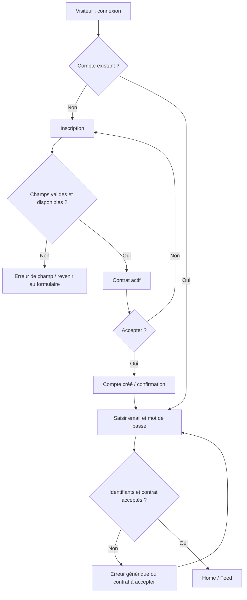
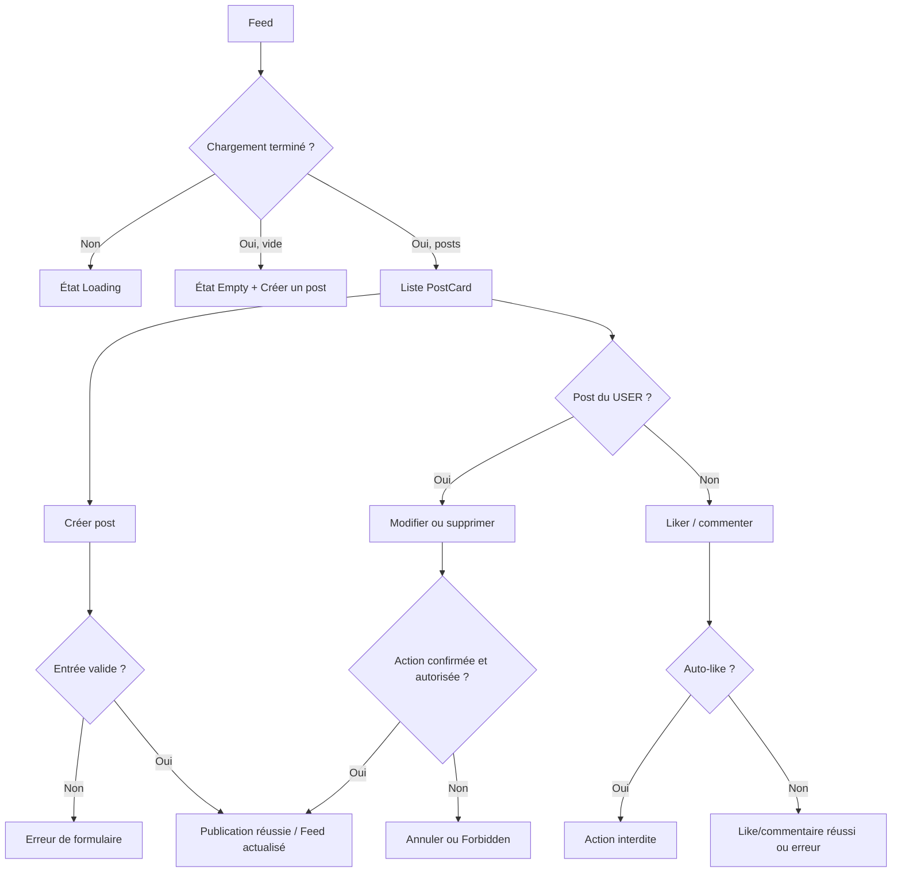
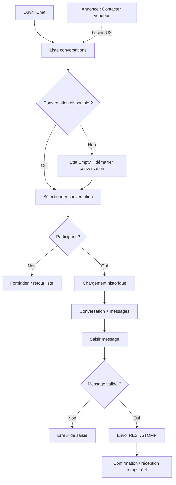
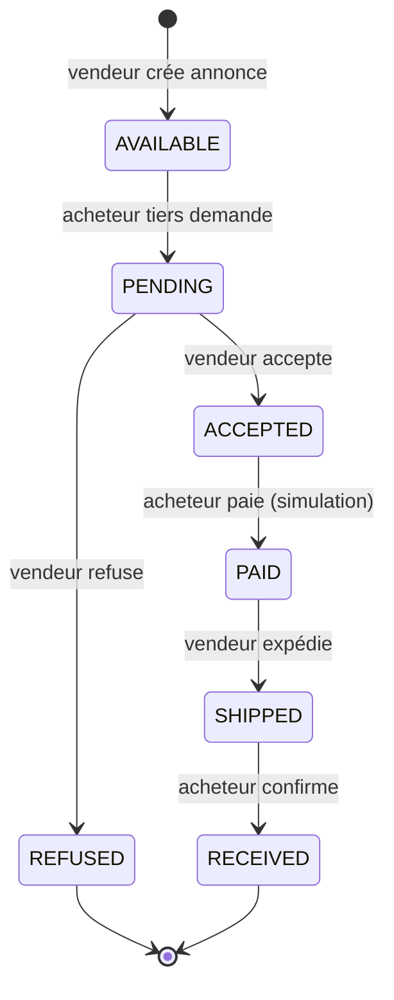

# Parcours utilisateurs

## FLOW-AUTH — inscription, contrat et connexion

**Départ :** visiteur. **Fin :** Home authentifié ou retour au formulaire. **Décisions :** validité, unicité, contrat, authentification. **Erreurs :** email invalide, compte existant, mot de passe invalide, contrat absent/non accepté, réseau.

## FLOW-FEED — publier et interagir

**Départ :** Feed. **Fin :** feed actualisé ou état d'erreur. **Décisions :** ownership, auto-like, validation, visibilité. **Règles :** BR-POST-001 à 004, BR-LIKE-001/002, BR-COMMENT-001.

## FLOW-CHAT — conversation sociale ou négociation

**Note :** l'entrée « Contacter le vendeur » est une intention UX. Le lien technique Listing–Conversation n'est pas conçu ni présumé dans ce flux. **Erreurs :** aucun chat, chargement, non membre, échec réseau, message invalide.

## FLOW-MARKETPLACE — cycle de vente simulé

| Étape | Acteur / décision | Erreur / retour | Fin locale |
|---|---|---|---|
| Liste | USER consulte/filtres, ou Empty | erreur de chargement → Réessayer | sélection détail ou création |
| Détail AVAILABLE | acheteur tiers : demander ou contacter vendeur | vendeur sur sa propre annonce : action indisponible | PENDING après confirmation |
| PENDING | vendeur : accepter/refuser ; acheteur : attente/contacter | tiers : Forbidden | ACCEPTED ou REFUSED |
| ACCEPTED | acheteur : paiement **simulé** | solde insuffisant/état invalide : erreur sans transition | PAID |
| PAID | vendeur : expédier | rôle/état invalide : Forbidden/erreur | SHIPPED |
| SHIPPED | acheteur : confirmer réception | rôle/état invalide : Forbidden/erreur | RECEIVED |

## États interface communs

| État | Décision UX future |
|---|---|
| Loading | squelette/texte « Chargement… », éviter écran blanc |
| Empty | expliquer l'absence et proposer une action autorisée |
| Success | confirmation courte, non intrusive, reliée à l'action |
| Error | message clair, action Réessayer/Retour, sans erreur technique |
| Forbidden | « Vous n'avez pas l'autorisation », retour sûr, aucune donnée révélée |
