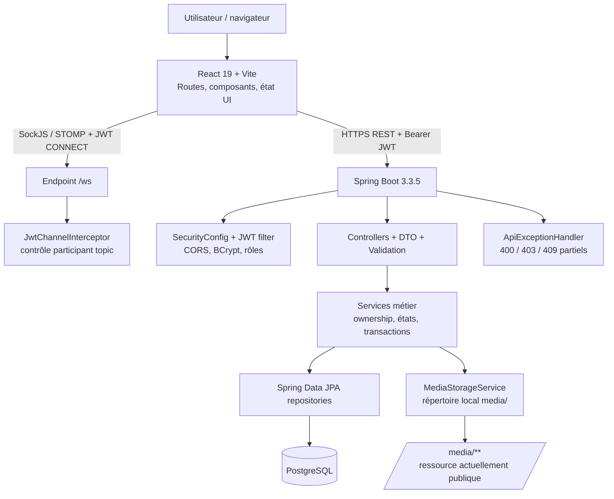

# Diagramme d’architecture globale

## Flux REST représentatifs

### FLOW-REST-01 — Création de post

`USER → React FormData → POST /api/posts + Bearer → JwtAuthenticationFilter → PostController → validation → PostService (identité/ownership) → PostRepository → PostgreSQL → réponse → React`.

### FLOW-REST-02 — Paiement simulé marketplace

`Acheteur → POST /api/marketplace/listings/{id}/pay → JWT → MarketplaceController → MarketplaceService.paySecured → verrou listing + état + buyer + unicité transaction → TransactionService.transfer → WalletService + TransactionRepository + ListingRepository → réponse`.

### FLOW-REST-03 — Connexion

`Visiteur → POST /api/auth/login → AuthController/AuthService → vérification BCrypt → JwtUtil (JWT 24h) → réponse token → frontend localStorage observé → Bearer aux appels suivants`.

Ces flux décrivent l’existant/cible immédiate ; le contrôle contrat réel dans le login reste GAP-AUTH-001.
