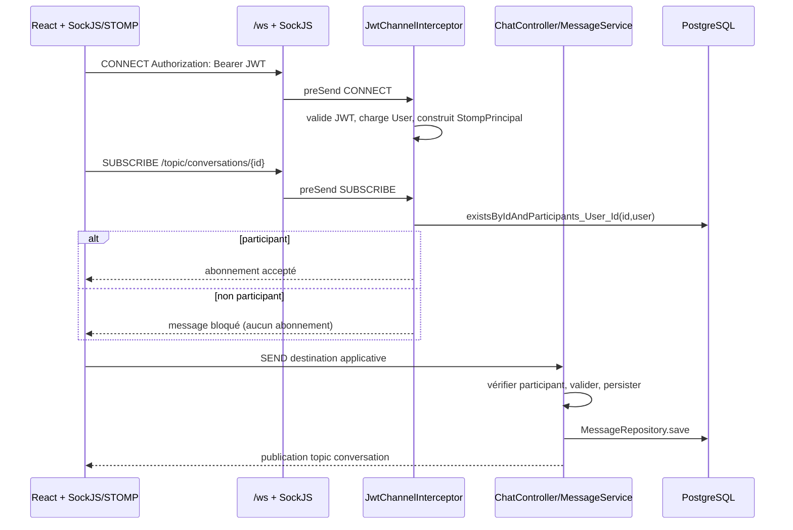

# Flux WebSocket / STOMP

## Observé et exigences

- `/ws` est enregistré avec SockJS ; `/app` est préfixe applicatif et `/topic`/`/queue` utilisent le simple broker (`WebSocketConfig`).
- Le `CONNECT` exige `Bearer JWT` ; le `SUBSCRIBE` sur `/topic/conversations/{id}` vérifie l’appartenance (`JwtChannelInterceptor`).
- Les contrôles REST de lecture/envoi de message doivent rester cohérents avec cette barrière ; l’endpoint legacy `/api/messages/{conversationId}/all` est un gap P0 historique (issue #3) à traiter/vérifier.
- Le navigateur n’est jamais une autorité : le JWT et l’appartenance doivent être revalidés côté serveur.
