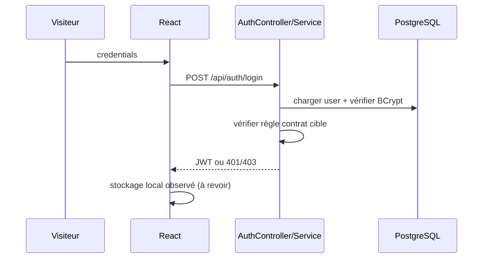
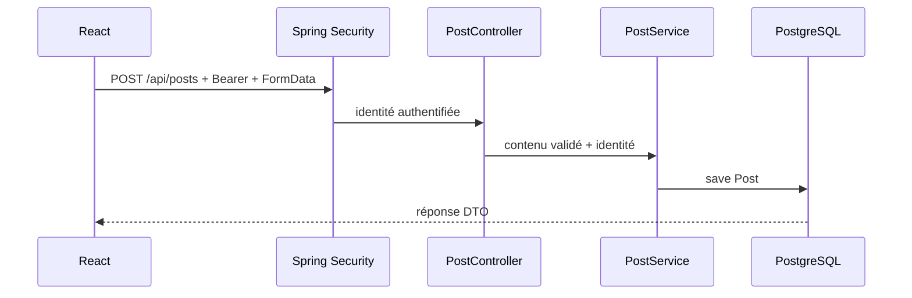
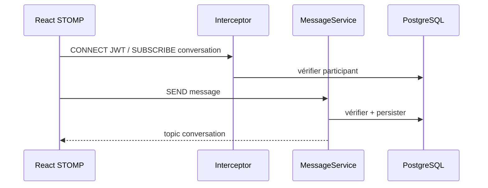
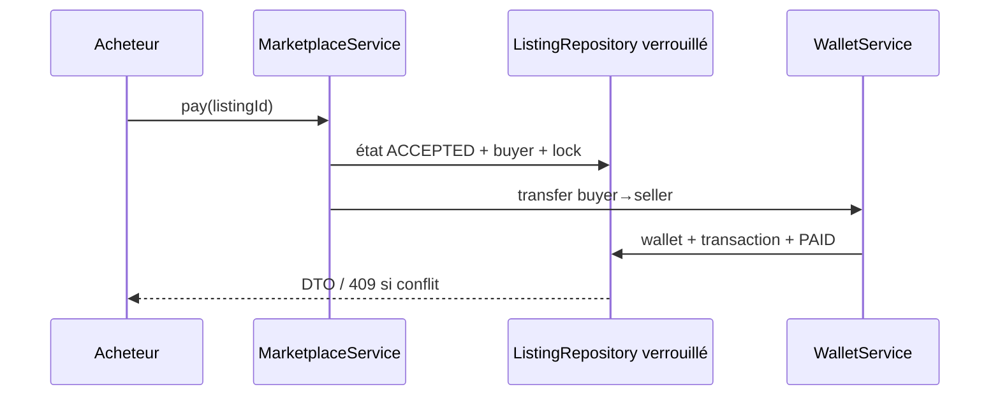

# Diagrammes de séquence

## Authentification

```mermaid
sequenceDiagram
  participant U as Visiteur
  participant R as React
  participant A as AuthController/Service
  participant DB as PostgreSQL
  U->>R: credentials
  R->>A: POST /api/auth/login
  A->>DB: charger user + vérifier BCrypt
  A->>A: vérifier règle contrat cible
  A-->>R: JWT ou 401/403
  R->>R: stockage local observé (à revoir)
```

## Création d’un post

```mermaid
sequenceDiagram
  participant R as React
  participant S as Spring Security
  participant C as PostController
  participant M as PostService
  participant DB as PostgreSQL
  R->>S: POST /api/posts + Bearer + FormData
  S->>C: identité authentifiée
  C->>M: contenu validé + identité
  M->>DB: save Post
  DB-->>R: réponse DTO
```

## Chat

```mermaid
sequenceDiagram
  participant R as React STOMP
  participant I as Interceptor
  participant M as MessageService
  participant DB as PostgreSQL
  R->>I: CONNECT JWT / SUBSCRIBE conversation
  I->>DB: vérifier participant
  R->>M: SEND message
  M->>DB: vérifier + persister
  M-->>R: topic conversation
```

## Marketplace

```mermaid
sequenceDiagram
  participant B as Acheteur
  participant S as MarketplaceService
  participant DB as ListingRepository verrouillé
  participant W as WalletService
  B->>S: pay(listingId)
  S->>DB: état ACCEPTED + buyer + lock
  S->>W: transfer buyer→seller
  W->>DB: wallet + transaction + PAID
  DB-->>B: DTO / 409 si conflit
```
