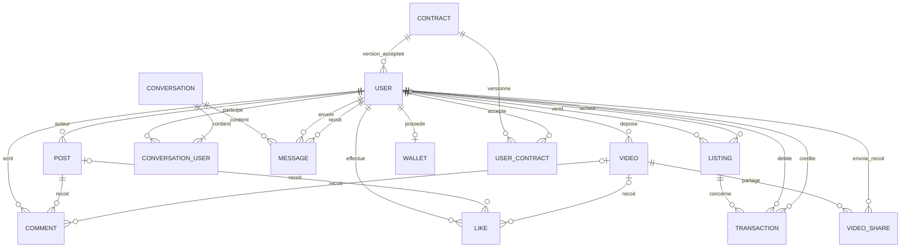

# MCD — Modèle conceptuel des données

## Cardinalités métier retenues

Un post a un auteur ; un commentaire/like cible actuellement **un post ou une vidéo** (exclusivité cible à imposer par contrôle/contrainte). Une conversation a au moins des participants dans le métier, mais l’entité seule ne l’impose pas. Un listing a un vendeur et éventuellement un acheteur. Un wallet appartient à un seul user. Le MCD MVP ne relie pas Conversation à Listing, conformément à ADR-006.

