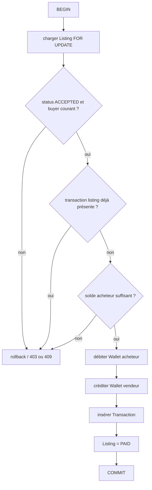

# Modèle transactionnel — paiement simulé

## Données touchées

`listings` (verrou/statut), `wallet` acheteur, `wallet` vendeur, `transaction`. Le service actuel possède `@Transactional`, verrou pessimiste sur listing et garde `existsByListing_Id`; la contrainte unique DB sur listing est une cible indispensable pour compléter la défense contre concurrence.

